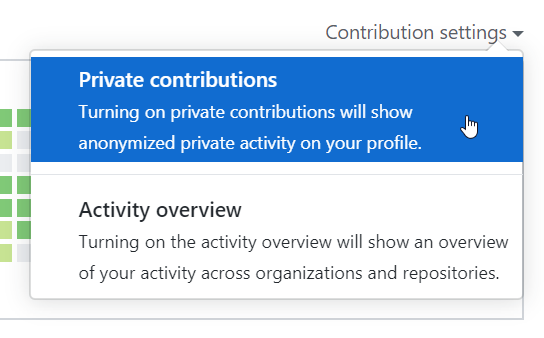

# Auto Populate GitHub Contribution Graph
- A Small Contribution To GitHub Community, To  Auto Fill Up GitHub Contribution Graph Of Previous Dates By **DEVELOVERZ**

> **Warning**
> Don't Push your Complete Code To Your Repository, Following 8 Steps Are Enough To Fill-up Your Commit Graph In GitHub

> **Note**
> Set Graph Setting **PRIVATE** In Your GitHub, As Shown Below 

### Follow THe Following StepsTO Achive Goal:
1. You Need To Create A **Private** Repo TO GitHub With Readme.md File Included.
2. Clone That Repo To Your Sytem.
3. Open Terminal or cmd and type `npm init` and fill up Credentials.
4. Create 2 Files, Name as **index.js** & **data.json** .
5. install Following 3 packages.
    1. `npm install jsonfile`
    2. `npm install moment`
    3. `npm install simple-git`

6. Copy Code From **index.js**, which is Given In This Repository And Past It Into Your **index.js** File.
7. You Will See The Last Time Of **index.js** file have code Of Function Call `commitBot(number_Of_Commits)` , where *number_Of_Commits* is An  Integer and You can Replace It With Your Required No Of Commits, *Enample* : `100` , `500` etc
8. Now Its The Last Step, Open Terminal And Type `node index.js`.

